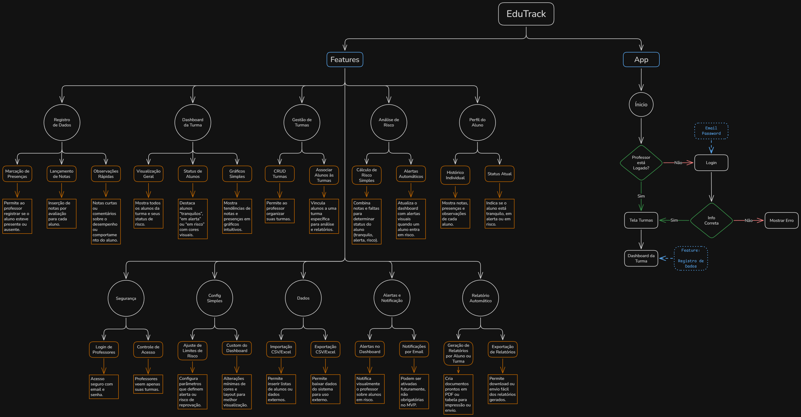

# EduTrack

  

EduTrack is a lightweight platform that helps teachers monitor students efficiently by transforming basic academic data into actionable insights.

No bureaucracy. No spreadsheets. Just clarity.

---

## 🚩 The Problem

Teachers already do the hard work:
- Teaching classes
- Correcting exams
- Supporting students

But on top of that, they must:
- Track attendance manually  
- Manage grades across tools  
- Identify struggling students too late  
- Write repetitive reports  

The result: **late interventions and wasted time**.

---

## 💡 The Idea

EduTrack solves this by asking teachers to do **only the basics**:
- Mark attendance  
- Insert grades  
- Add short observations  

From there, the system:
- Analyzes performance automatically  
- Flags students at risk  
- Generates ready-to-use reports  

This is **not about replacing teachers** — it’s about helping them act earlier.

---

## ✨ MVP Features

### 📋 Data Registration
- Attendance tracking  
- Grade input  
- Quick student notes  

### 👨‍🏫 Class & Student Management
- One teacher → multiple classes  
- Students linked to classes  
- Individual student profiles with history  

### 📊 Dashboard
- Class overview  
- Student status: **Safe / Alert / At Risk**  
- Simple charts for performance and attendance  

  

### ⚠️ Risk Analysis
- Basic logic combining grades and absences  
- Automatic status updates in real time  

### 📄 Reports
- Automatic generation per student or class  
- Export as PDF or table  

### ⚙️ Configuration
- Adjustable risk thresholds  
- Minimal dashboard customization  

### 🔐 Security
- Email/password authentication  
- Teachers only access their own classes  

---

## 🧠 MVP Flowchart

  

> The system continuously loops between data input, risk analysis, and dashboard updates.

---

## 🛠 Tech Direction (MVP)

| Layer | Description |
|------|------------|
| Frontend | Simple forms + dashboard |
| Backend | REST API + risk logic |
| Database | Dedicated internal database |
| Hosting | Single cloud environment |

---

## ⏱ MVP Scope & Timeline

- **Team:** 3 people  
- **Duration:** ~1 month  
- **Focus:** Functionality over perfection  
- **No:** Advanced AI, heavy automation, or deep integrations  

> This MVP exists to **validate the problem and solution**, not to scale.

---

## 📌 Status

🚧 In active development

---

## 📄 License

MIT (to be confirmed)
